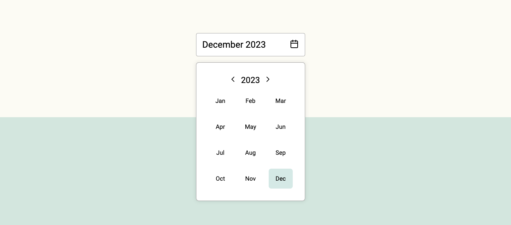

# React Lite Month Picker

    

Simple, modern and customizable month picker component for ReactJS.




## Installation

Using npm:

```bash
npm install react-lite-month-picker --save
```

## Usage

```jsx
import { useState } from 'react';
import { MonthPicker, MonthInput } from 'react-lite-month-picker';

function Example() {
  const [selecedMonthData, setSelectedMonthData] = useState({
    month: 9,
    year: 2023,
  });
  const [isPickerOpen, setIsPickerOpen] = useState(false);

  return (
    <>
      <div>
        <MonthInput
          selected={selecedMonthData}
          setShowMonthPicker={setIsPickerOpen}
          showMonthPicker={isPickerOpen}
        />
        {isPickerOpen ? (
          <MonthPicker
            setIsOpen={setIsPickerOpen}
            selected={selecedMonthData}
            onChange={setSelectedMonthData}
          />
        ) : null}
      </div>
    </>
  );
}

export default Example;
```

### Selected month data

Currently selected month data is an object with the following structure:

```js
{
  month: 9,
  year: 2023,
  monthName: 'September',
  monthShort: 'Sep'
}
```

It will get saved on set parent component state with `onChange` event.

## Customization

You can customize the `MonthPicker` component styles by passing props to it.

| Prop name            | Description                                   | Default value |
| -------------------- | --------------------------------------------- | ------------- |
| `bgColorMonthActive` | Background color of the active month.         | `#4ea3983e`   |
| `bgColorMonthHover`  | Background color of the month on mouse hover. | `#f4f4f4`     |
| `borderRadiusMonth`  | Border radius of the moth element.            | `7px`         |
| `bgColorPicker `     | Background color of the picker element.       | `#fff`        |
| `textColor`          | Color of the text.                            | `#000`        |

\
\
You can customize the `MonthInput` component styles by passing props to it.

| Prop name      | Description                                           | Default value |
| -------------- | ----------------------------------------------------- | ------------- |
| `bgColor`      | Background color of the input element.                | `#fff`        |
| `bgColorHover` | Background color of the input element on mouse hover. | `#fff`        |
| `textColor`    | Color of the text.                                    | `#000`        |
